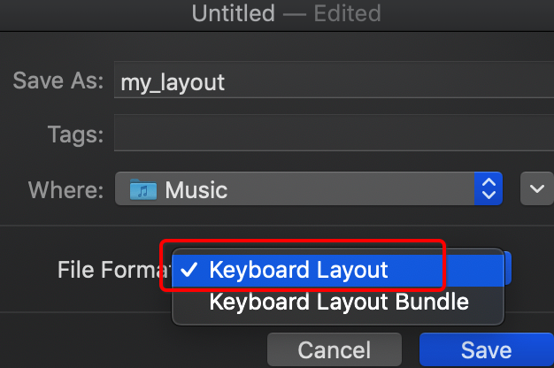
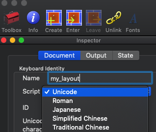
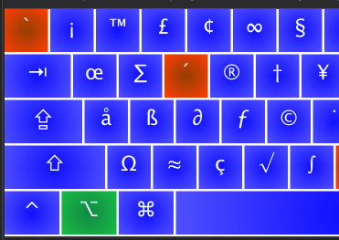
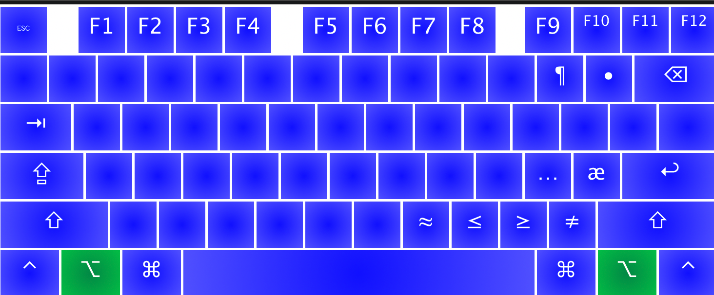
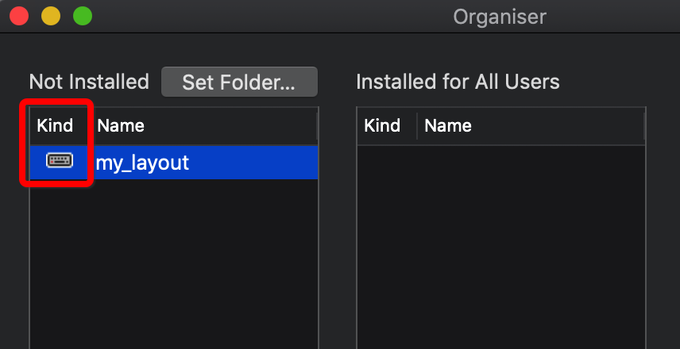

# [禁用option/alt键的特殊符号](/2019/11_2/ukelele/disable_alt_symbol_ukelele)

相关文章 - [mac init(配置等)](2019/10/mac-init)

对软件开发人员来说，mac的alt键+字母/数字 会输出œ´∫之类不想要的symbol

严重地影响了emacs之类软件的默认快捷键，
[网上有很多解决方案](https://stackoverflow.com/questions/11876485/how-to-disable-typing-special-characters-when-pressing-option-key-in-mac-os-x)

emacs的问题可以通过Termial设置`use option as meta key`解决

可是想要全局解决比较麻烦(我曾经因为误触Alt+字母，导致代码因特殊符号出现bug)

## ukelele keyboard layout

解决方案：安装ukelete
[ukelele官网](http://software.sil.org/ukelele)

<i class="fa fa-hashtag mytitle"></i> 1. new layout duplicate current

通过以当前layout为基准duplicate一个layout

1.1. 首先把输入法切换到en-us或ABC

1.2. ukelele->New from current Input Source

1.3. 出现一个选择框，双击ABC就进入到新的键盘窗口

?> 可以把untitled的窗口关了

<i class="fa fa-hashtag mytitle"></i> 2. 保存layout文件

出现标题为ABC copy的layout窗口后

cmd+s 保存布局文件，命名为my_layout

> [!DANGER|label:注意文件类型]
> 文件保存类型要选layout而不是bundle

> [!TIP|ukelele的布局文件存储位置]
> 未激活的layout文件放在`~/Documents` 
> 已激活的layout文件放在`~/Library/Keyboard Layouts`

我习惯把静态文件存在`~/Music/`

!> 已经激活的布局文件不允许修改

<i class="fa fa-hashtag mytitle"></i> 3. 设置布局名称

布局名称是显示在输入法选择处的名称，我习惯上与文件名保持一致

如图，点击info按钮可以设置布局名称，注意设置成Unicode

<i class="fa fa-hashtag mytitle"></i> 4. 「删除」alt键特殊符号

4.1 点击toolbox勾上`Sticky Modifiers`，之后按下alt就会显示所有alt符号

4.2 挨个按键地右键change output->删除

最后我留了几个我认为还有用的符号

<i class="fa fa-hashtag mytitle"></i> 5. 保存,install,登出

确保文件的图标是 ⌨️ 图标

<i class="fa fa-hashtag mytitle"></i> 6. 系统设置,Input Source

signout后，在添加输入法窗口可以看到my_layout

