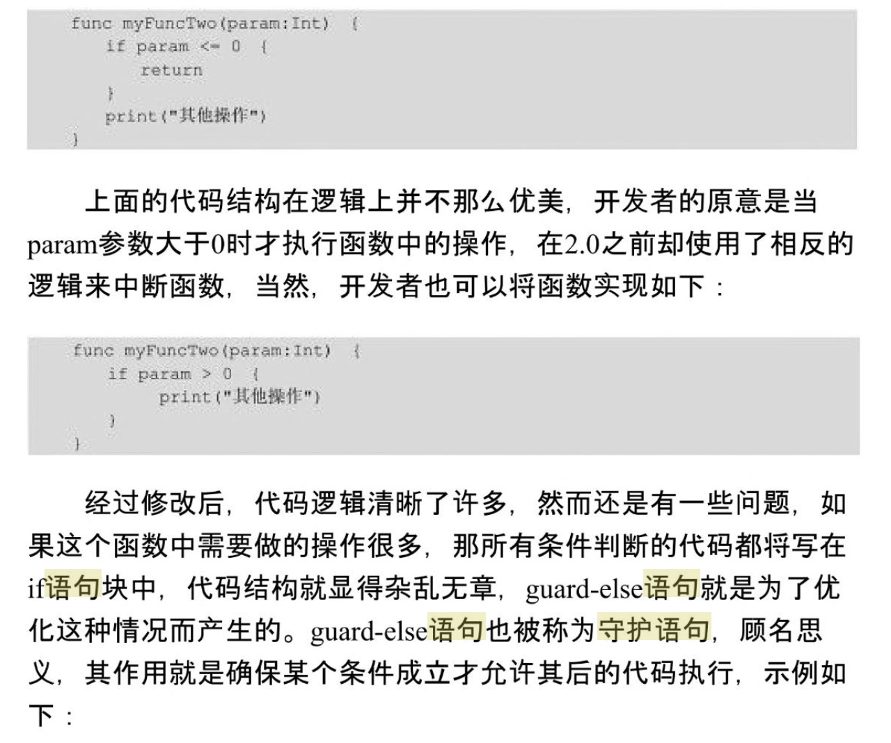

# [guard statement](/2019/12_2/guard_statement.md)



这是一种重构的方法，如

```ruby
if login?
  # ...
else
  return log_in
end
```

可以把这种验证型的，不通过就return的语句提到方法的最前面

让代码更简洁，减少了缩进的层数

```ruby
return log_in unless login?
# 如果验证的逻辑比较复杂或以后需要查log
# 则不要使用单行if else语句
unless log_in
  Rails.logger.info "== user not log in"
  return log_in
end
```
