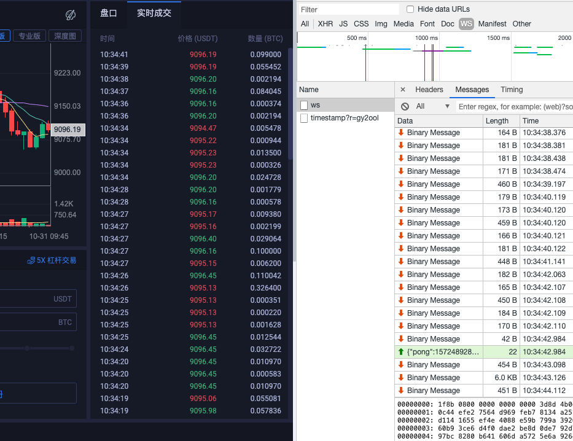

# [grape on racket](2019/11/grape.md)

## grape是什么

grape是一个REST-like APIs,可以通过[petstore.swagger.io](http://petstore.swagger.io/#/)可视化简单测试接口,当然还需要写单元测试去验证接口逻辑

## 为什么要学grape

### 火币交易的数据都是二进制加密的

除了交易的接口数据需要加密,别的数据比如帮助文档不加密也无所谓

友商MXC抹茶网的交易页面全是明文传输,信息很不安全

所以希望我们自己的交易所能通过websocket加密传输再由前端解密

### grape对ws的支持很好

所以我们就要用grape编写ws或binary frame的接口

## 配置开发环境

由于grape没有自带serve功能,所以网上的教程差异都很大

项目用的开发环境是ruby:2.6.1 bundle:2.0.2

!> rbenv安装一个新的ruby版本时需要重新安装bundle

> gem install bundler:2.0.2

1. cp config/database.yml.example config/database.yml
2. vim config/database.yml
3. bundle exec guard -d

## grape-swagger

在以下两个文件中实现了swagger的定义

- Gemfile:12:gem 'grape-swagger'
- app/api.rb:5:    add_swagger_documentation(

启动服务器后在

## grape连数据库

### mysql样例数据库

[mysql官网的sample数据库employees](https://dev.mysql.com/doc/index-other.html)

一般都是用 source命令导入,不过教程要求要用 mysql -u root -p < employees.sql导入

employees并没有多对多的映射,不利于练习,不建议使用,建议使用[这个sample数据库](http://www.mysqltutorial.org/mysql-sample-database.aspx)

从图中或查询可知products和orders之间是多对多的关系

### 手动创建Model

先在database.yml中把数据库名字改了

然后在app/models下新建一个与数据库同名rb文件即可,继承ActiveRecord类,类名字是单数

### 将cadae的managers表迁移到其它db中

> mysqldump -u... -p... mydb tableName1 tableName2 > mydb_tables.sql
