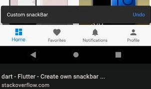

# [安卓笔记](/2020/01/android_notes.md)

## Fragment newInstance

Fragment无法通过构造方法传参，最佳实践是定义一个newInstance静态方法

Android Studio中可以通过<var class="mark">newInstance</var>自动生成出Fragment的newIntance方法

```java

```

## 打log的最佳实践

> 不要为了显眼而使用Log.e

<i class="fa fa-hashtag"></i>
去掉log中无用的前缀，提高信噪比

如`2020-01-08 20:18:34.040 20145-23939/com.monitor.exchange`这种前缀不该出现在log中

[Hide datetime in android log](https://stackoverflow.com/questions/18125257/how-to-show-only-message-from-log-hide-time-pid-etc-in-android-studio)

<i class="fa fa-hashtag"></i>
分段打印Log

安卓的log消息过长，好像会截断(例如打印接口返回的json数据)

## TextView+drawableLeft

> This tag and its children can be replaced by one <TextView/> and a compound drawable

一个TextView+ImageView可以写成一个TextView(加上一个drawable属性)，而且渲染性能更好

[https://stackoverflow.com/questions/3214424/android-layout-this-tag-and-its-children-can-be-replaced-by-one-textview-and](https://stackoverflow.com/questions/3214424/android-layout-this-tag-and-its-children-can-be-replaced-by-one-textview-and)

## Snackbar



```java
Snackbar.make(findViewById(android.R.id.content).getRootView(),
  "Snackbar.make",
  Snackbar.LENGTH_SHORT)
  .show();

// 带Undo按钮
Snackbar mySnackbar = Snackbar.make(findViewById(R.id.myCoordinatorLayout),
        R.string.email_archived, Snackbar.LENGTH_SHORT);
mySnackbar.setAction(R.string.undo_string, new View.OnClickListener {
  // ...
});
mySnackbar.show();
```

## invisible和gone的区别

invisible：不显示，但是会保留组件占有的空间

此外对于ListView、GridView和RecycleView而言，还有额外的差异

> Adapter's getView() function didn't call, thus preventing views to load, when it is unnecessary

## StringBuffer和StringBuilder

拼接GET请求参数时需要使用可变字符串，StringBuffer是线程安全的

> StringBuffer is synchronized(线程安全), StringBuilder is not.
