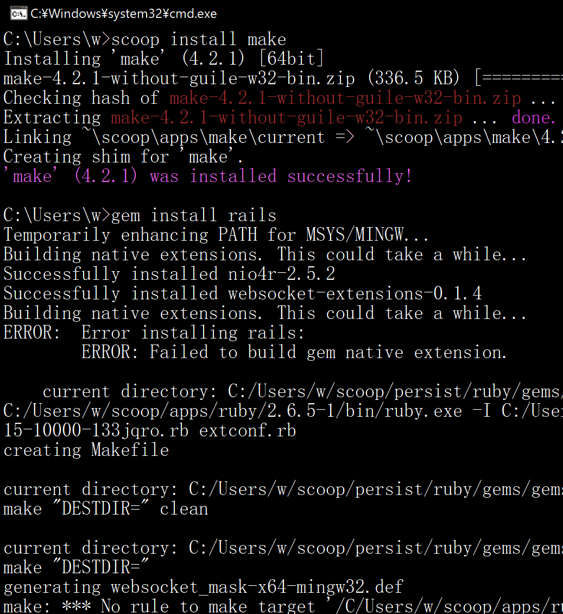

# 再次学习Ruby

以前在soloLearn上面学过一次ruby，虽然后面mixin等学得一知半解。

很多ruby岗位的JD上面都提到metaprogramming(元编程)，好像soloLearn的课程没有介绍

如今由于工作需要再次学习rails，回顾一下曾经用过的资料：

- 官方API文档
- 软件那些事出过的几集ruby视频
- 台湾高見龍的「為你自己學 Ruby on Rails」
- https://guides.rubyonrails.org/getting_started.html

打算就先按高見龍的教程过一遍，等我熟悉rails后再把默认的模板引擎换成vuejs

## 试着用scoop安装rails



果然scoop就不适合安装这种依赖复杂的cli软件，毕竟scoop安装ruby的时候就提示我要额外安装这个那个的依赖

ruby本身就对非UnixLike系统不友好，windows只能用官方推荐的【rubyInstaller】进行安装

而且安装完后win10还会有gem install sqlite的问题，可以参照[medium上这篇文章去解决](https://medium.com/@declancronje/installing-and-troubleshooting-ruby-on-rails-sqlite3-windows-10-fix-87c8886d03b)

## 学习目标

最终完成一个Rails+Vue的在线做题网站，数据库就用SQLite就行了。

试用期内要达到公司提的要求是（Rails，Vue，vim，标准指法，普通话）。

关于标准指法，根据typeclub.com的测试结果我标准指法只有7WPM的速度，而同样100%正确率自己习惯的打法速度在50-60WPM之间，而且我能盲打很熟悉每个键的位置，参考[v2ex.com/t/221161](https://www.v2ex.com/t/221161)，指法问题先放下。

## ruby运算回顾

ruby的多行注释是在=begin和=end之间

```ruby
# ruby常量ID以大写字母开头
class Calc
  PI = 3.14
end
puts Calc::PI
```

nil≈null,nil is a instance of NilClass  
没有返回值的表达式会在irb上显示=>nil

.reverse! 逆序并改变值 感叹号表示這個方法會有「副作用」  
字符串常用方法.include?、.empty?、.gsub(replace)

实现列表追加，可以用<< OR + OR  逻辑或|

### [reduce]ruby从1加到100

(1..100).to_a.each ==  [*1..100].each

> puts [*1..100].reduce(:+) # 星号跟python中一样能把一个list拆开


### ruby.随机数

> puts [*1..100].shuffle.first(5)
> puts [*1..100].sample(5)

### 【精准计算】ruby.BigDecimal

### ruby.puts

我們很常用的 puts 方法，它其實就是 Object 這個類別的 private 方法之一（更正確的說，是 Kernel 模組 mixin 到 Object 類別裡的方法）

puts/p/print/.to_s/.inspect: p跟puts一样会换行，区别是会完整打印列表等结构，而且有返回值  
puts相当于.to_s, p相当于.to_s

Ruby有提供另一種字串的表現方式，分別是 %Q 跟 %q，各代表雙/單引號  
> puts %Q(你好，#{name}) # 跟雙引號一樣，可以使用字串安插  

## ruby变量与流程控制

### ruby method and OOP

> [!NOTE]
> Rbuy執行方法，可以省略小括號

定义完方法fun后ruby会内部产生一个Symbol  :fun  
可以通过send(:fun)调用函数

ruby方法中的最后一个表达式会自动返回，可以省略return

ruby函数最后一个参数如果是hash，则可以省略大括号  
  省略前|<%= link_to('刪除', user, {method: :delete, data: { confirm: 'sure?' }, class:'btn'}) %>  
  省略后| <%= link_to '刪除', user, method: :delete, data: { confirm: 'sure?' }, class:'btn' %>  
  就看第一个出现英文+冒号的说明这是hash第一个键，就这样识别把

### Ruby 並沒有「屬性」（property/attribute）的設計

某天下午我还与上司争论ROR中，为什么不用类变量/静态变量而是用def实现变量，原来ruby的类就不能有变量

ruby的class method的前缀是self.

### ruby.variable

种类:local/global/instance/class variabl  
举例:$gloabl=100,@@class=nil,@instance=nil  
在irb直接操作类变量会有warning: class variable access from toplevel  

常量以大写字母开头，內容是可以修改的，

```ruby
age = 18

def age
  20
end

# 局部变量和方法名冲突时，优先局部变量
puts age # 18
puts age # 20
```

### hash and symbol

ruby的键通常都用不可变immutable字符串Symbols表示，如:age  
【注意】ruby 要用profile[:name]取hash的值而不能用profile["name"]  
因為 Symbol 不可變（immutable）的特性，以及它的查找、比較的速度比字串還快，它很適合用來當 Hash 的 Key。  

```ruby
hash1.each do |key, value|
  puts "#{key}:#{value}"
end
#same as
hash1.each { |key, value|
  puts "#{key}:#{value}"
}
```


### case-when-end

1..4  = [1,2,3,4]
1...4 = [1,2,3]

unless=if not
until=while not

```ruby
case age
  when 0..3
    puts "Baby"
  when 4..17
    puts "Kids"
  when 60,65
    puts "Pension"
  else
    puts "Adult"
end
```

## ruby匿名函数

> arr.select(&:odd?) == arr.select{|each| each.reverse}

### ruby.block-yield

如果想要讓附掛的 Block 執行，可使用 yield 方法，暫時把控制權交棒給 Block，
等 Block 執行結束後再把控制權交回來：
```ruby
  def say_hello
    puts "開始"
    yield 123     # 把控制權暫時讓給 Block，並且傳數字 123 給 Block
    puts "結束"
  end

  say_hello { |x| # 這個 x 是來自 yield 方法
    puts "這裡是 Block，我收到了 #{x}"
  }
```

```ruby
#自己实现.select方法/过滤器
  def pick(list)
    result = []
    list.each do |i|
      result << i if yield(i)            # 如果 yield 的回傳值是 true 的話...
    end
    result
  end

  p pick([*1..10]) { |x| x % 2 == 0 }    # => [2, 4, 6, 8, 10]
  p pick([*1..10]) { |x| x < 5 }         # => [1, 2, 3, 4]

```

p([*1..10].map) do |i| i * 2 end
因為優先順序較低，所以變成先跟 p 結合了，造成後面附掛的 Block 就不會被處理了。
一：do..end优先度较低，二:如果block有多行优先使用do..end

可以通过Proc类使block object化

```ruby
def say_hello1
  yield if block_given?
end

def say_hello2 &p #block  &p:block p:proc
  p.call
end

def say_hello3 p
  p.call
end

say_hello1 do
  puts 'hello1'
end
say_hello2 {puts 'hello2'}
p = lambda {puts 'hello3'}
puts p
say_hello3 p
p1 = proc {puts 'hello3'}
puts p1
say_hello3 p1
p2 = Proc.new {puts 'hello3'}
puts p2
say_hello3 p2
p3 = -> {puts 'hello3'}
puts p3
say_hello3 p3
```


