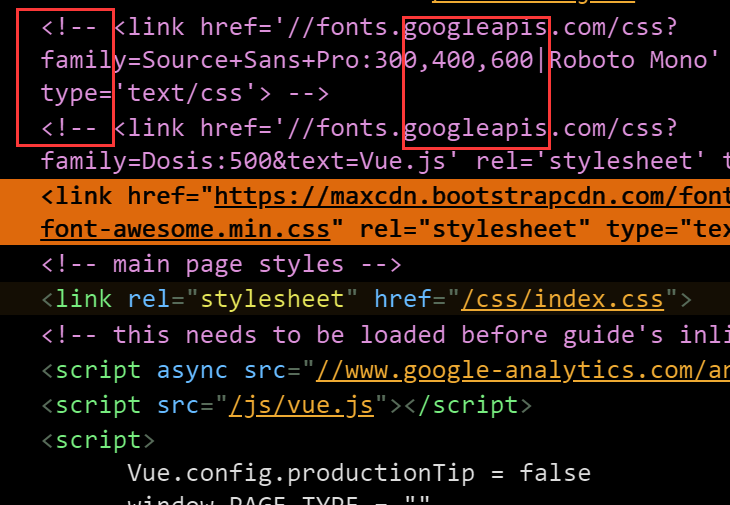

# 谷歌字体库被墙的解决方案

## 博客引用的谷歌字体库被墙

[我博客](https://pymongo.github.io)用的是docsify框架,而docsify框架又是参照在**vue**文档的css

但是vue.css中有这么一行:

> @import url("https://fonts.googleapis... (以下简称为"google字体网址")

由于带google的域名都被墙, 加载google字体网址常常等到TIMEOUT

## 分析下谷歌字体库的GET请求

Google字体库的完整GET请求链接是：

> https://fonts.googleapis.com/css?family=Roboto+Mono|Source+Sans+Pro:300,400,600

> [!NOTE|style:flat|label:GET请求中各特殊符号的含义]
> css?是常见的HTTP参数开始标志, +表示空格, |表示逻辑和<br>
> 请求的是Roboto Mono和Source Sans Pro字体的300,400,600三种线宽<br>
> font-weight默认是400, 所以没必要写成Roboto+Mono:400|Source...

?> 分析其中一个@font-face

```css
/* greek */ /* 表示font-family Unicode的希腊字母部分 */
@font-face { // 定义新的font-family
    font-family: 'Roboto Mono';
    font-style: normal;
    font-weight: 400;
    src: local('Roboto Mono'), local('RobotoMono-Regular'), url(https://fonts.gstatic.com/s/robotomono/v5/L0x5DF4xlVMF-BfR8bXMIjhIq3-OXg.woff2) format('woff2'); /* 先看系统本地有无该字体再请求 */
    unicode-range: U+0370-03FF; /* 表示font-family Unicode的希腊字母部分 */
}
```

## 解决方案一:使用镜像

[loli.net的常用前端镜像<i class="fa fa-list-alt"></i>](https://css.loli.net/)

```
https://fonts.loli.net/css?family=Roboto+Mono|Source+Sans+Pro:300,400,600
```

或 [(不好使🙅‍♀️)中科大提供的字体库镜像](https://lug.ustc.edu.cn/wiki/mirrors/help/revproxy)

https://fonts.proxy.ustclug.org/css?family=Roboto+Mono|Source+Sans+Pro:300,400,600

[总结一下各大CDN - v2ex](https://www.v2ex.com/t/320418)

!> 缺点: 免费的镜像源不如商业公司可靠，无法离线使用

## 解决方案二:看vue是如何解决的

看看vue的中文文档是如何解决的



vue中文版文档直接把英文版的谷歌字体请求部分给【注释掉】，然后用服务器本地的字体文件

vue中文版把需要用到的字体提前放在自己服务器上的, 参考[vue中文文档的github项目](https://github.com/vuejs/cn.vuejs.org/tree/master/themes/vue/source/fonts)

```css
/* 这是styl文件 */
@font-face
    font-family: "Source Sans Pro" /* styl这里没有分号 */
    src: local("Source Sans Pro"), url(/fonts/Source_Sans_Pro/SourceSansPro-Regular.ttf)
```

我很好奇styl文件编译成css后, 把字体等静态文件资源路径给改变了
